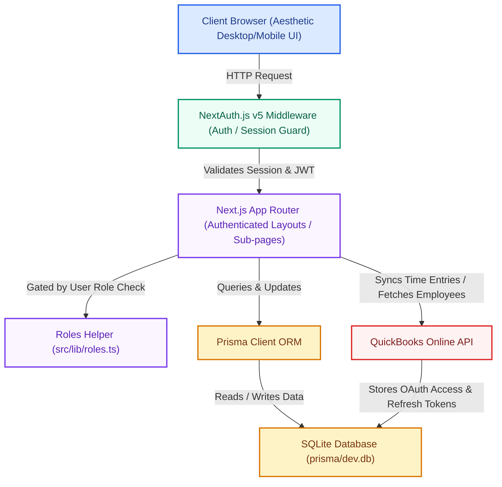

# Henley Hub Setup Guide

This guide contains instructions on how to set up, configure, and run Henley Hub locally on your system.

---

## 🛠️ System Prerequisites

Ensure you have the following installed on your machine before starting:

1. **Node.js**: Version `20.0.0` or higher is required (configured in `.nvmrc` and `package.json` engines).
   - Verify with: `node -v`
2. **npm**: Installed automatically with Node.js.
   - Verify with: `npm -v`
3. **Git**: For source control and version management.
4. **SQLite**: The local database runs on SQLite via a file-based setup (`prisma/dev.db`). You do not need to install an external database engine.
5. **OpenSSL**: (Recommended) Used for generating secure secrets for session authentication.

---

## 🚀 Local Quick Start

Follow these steps to get the application up and running on your local machine:

### 1. Configure Environment Variables
Copy the example environment file to create your local configuration:
```bash
cp .env.example .env
```

Open the newly created `.env` file and set up a secure `AUTH_SECRET`. You can generate a random 32-character hex string using OpenSSL in your terminal:
```bash
openssl rand -hex 32
```
Copy the generated value and assign it to `AUTH_SECRET` in `.env`:
```env
AUTH_SECRET="your_generated_hex_secret"
```

### 2. Install Project Dependencies
Install the required packages using `npm`:
```bash
npm install
```
*Note: This will also trigger `prisma generate` post-install to build the Prisma client types.*

### 3. Initialize and Seed the Database
Run the database reset script to apply Prisma schemas to your local SQLite file and seed the database with mock records:
```bash
npm run db:reset
```
This runs `prisma db push --force-reset` followed by the seeding script `prisma/seed.ts`.

### 4. Start the Development Server
Launch the Next.js development server:
```bash
npm run dev
```

The application will be accessible at: **[http://localhost:3000](http://localhost:3000)**

---

## 📦 Project Dependencies Breakdown

### Core Framework & Runtime
*   **Next.js 15 (App Router)**: Drives the hybrid static/server-rendered routing structure and Server Actions.
*   **React 19**: Standard runtime supporting server components and modern web APIs.
*   **TypeScript**: Ensures end-to-end type safety throughout components, Server Actions, and DB queries.

### Database & State
*   **Prisma ORM**: Relational ORM mapping schemas directly to the SQLite backend.
*   **SQLite**: Embedded database used for local development, creating `prisma/dev.db`. Can easily scale to Postgres in production by changing the database provider in `prisma/schema.prisma` and updating `DATABASE_URL`.

### Authentication
*   **NextAuth.js v5 (Beta 25)**: Manages secure credentials authentication, session states via edge-compatible middleware, and JWT-based session stores.
*   **bcryptjs**: Used to hash and safely verify passwords stored in the database.

### Styling & Visuals
*   **Tailwind CSS**: Utility-first CSS framework for visual layouts.
*   **lucide-react**: Lightweight icon set matching the application layout.

---

## 🔐 Demo Logins & Roles

All demo accounts share the password: **`demo`**

| Email | Role | Accessible Sections & Visibility |
| :--- | :--- | :--- |
| **`kyle@henleyhub.com`** | CEO / Owner | Full Admin permissions, access to all projects, company financials, settings, team lists. |
| **`morgan@henleyhub.com`** | Office Staff / PM | CRM pipelines, all projects, inbox, estimates, and financials. No team management settings. |
| **`sam@henleyhub.com`** | Office Staff / Design | Design tracker, CRM pipelines, projects, inbox, estimates. No team settings. |
| **`jess@henleyhub.com`** | Field Crew (Lead Carpenter) | Assigned projects, log daily carpentry reports, time tracking entries. No financials or CRM pipelines. |
| **`danny@henleyhub.com`** | Field Crew | Assigned projects, daily logging, time entries. No financials or CRM pipelines. |
| **`tile-pro@subs.com`** | Subcontractor | View assigned schedules and tile projects only. No daily log feeds or financials. |
| **`rachel.t@example.com`** | Client Portal | View assigned project portal, client-visible milestones, approved selections, and shared daily logs. |

---

## 🔌 QuickBooks Integration Setup (Phase 2 Component)

The project includes built-in support for mapping local users to QuickBooks Online (QBO) employees and syncing approved hours.

To test QuickBooks sync, verify that the following variables are configured in your `.env` file:
```env
QB_CLIENT_ID="your_qbo_client_id"
QB_CLIENT_SECRET="your_qbo_client_secret"
QB_REDIRECT_URI="http://localhost:3000/api/auth/quickbooks/callback"
```
*Note: Make sure your QBO developer app redirect URL matches the `QB_REDIRECT_URI` value exactly.*

---

## 📊 Project Working Diagram

The diagram below illustrates the flow of a user request through the application stack, highlighting routing, authentication, role authorization, and backend communication paths.



---

## 🛠️ CLI Reference

Here are the scripts defined in `package.json` that you can run:

*   **`npm run dev`**: Runs the local next.js development server at `localhost:3000`.
*   **`npm run build`**: Compiles the application bundle for production usage.
*   **`npm run start`**: Launches a production server after running the build step.
*   **`npm run db:push`**: Pushes schema changes in `schema.prisma` directly to the SQLite database.
*   **`npm run db:seed`**: Re-populates the database using default seed values.
*   **`npm run db:reset`**: Resets the SQLite database and seeds it with default users/clients.
*   **`npm run db:seed:real`**: Seeds the database using real-world construction business scenarios.
